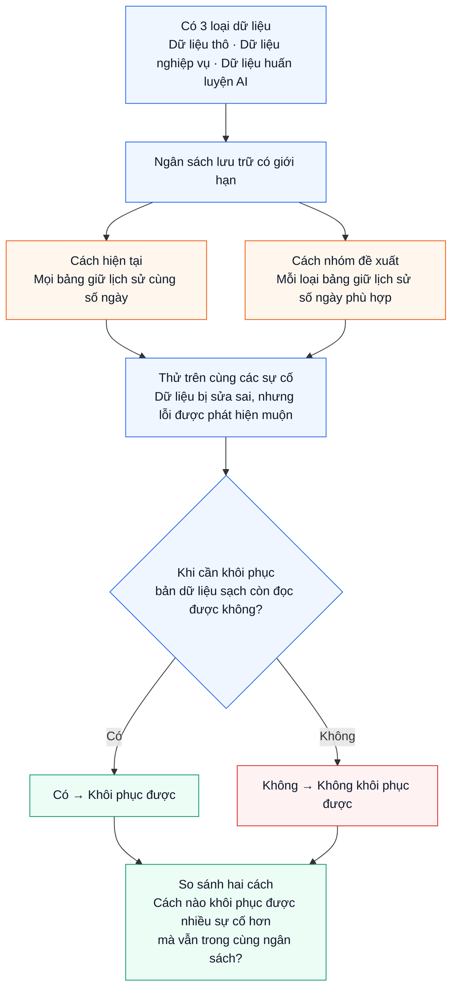

# Hiểu bài toán: Retention Policy Optimizer

**Với cùng ngân sách lưu trữ, mỗi loại bảng nên giữ lịch sử bao lâu để khôi phục được nhiều sự cố nhất?**

## Ví dụ dễ hiểu

Dữ liệu bị sửa sai hôm thứ Hai, đến thứ Sáu mới phát hiện. Nếu bản sạch trước lỗi vẫn còn đọc được thì có thể phục hồi; nếu đã bị dọn thì không.

Giữ lịch sử lâu hơn có thể tăng khả năng phục hồi nhưng tốn thêm dung lượng. Nhóm cần **chia ngân sách hợp lý giữa các loại bảng**, rồi đo tỷ lệ sự cố khôi phục được.

## Nhóm cần chứng minh điều gì?

- Hai cách dùng **cùng ngân sách** và được thử trên **cùng sự cố**.
- Cách đề xuất chọn thời gian giữ riêng cho từng loại bảng, thay vì một thời gian chung.
- Kết quả chính là **tỷ lệ sự cố khôi phục được**: số sự cố khôi phục được chia cho tổng số sự cố.
- Nếu cách đề xuất không tốt hơn, nhóm vẫn báo cáo kết quả thật và giải thích khi nào phương pháp thất bại.

Giữ lịch sử không thay thế backup: nếu mất toàn bộ nơi lưu dữ liệu và lịch sử, tăng số ngày giữ cũng không tạo ra một bản sao độc lập để phục hồi.

Sau khi đo, hệ thống xuất **report HTML** có bảng, biểu đồ và vài câu **nhận xét LLM**. LLM giúp giải thích kết quả; metric được tính bằng code đánh giá.

## Đọc tiếp

- [Sơ đồ triển khai và vai trò từng người](workflow.md)
- [Kế hoạch issue và deadline](issue-plan.md)
- [Tóm tắt tài liệu và phân tích đề tài 5](lakehouse-summary-topic-5.md)
