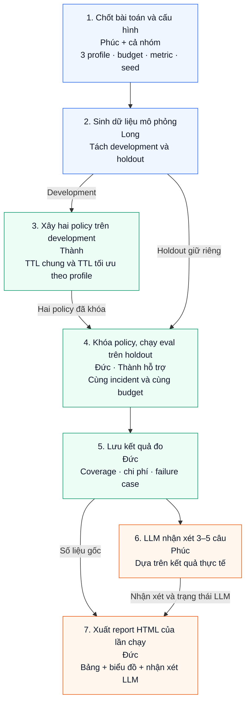

# Sơ đồ luồng: Retention Policy Optimizer

Mục tiêu: so sánh **một TTL chung** với **TTL riêng cho từng nhóm bảng**, trong cùng ngân sách giữ lịch sử. Mỗi lần chạy eval xuất report HTML kèm vài câu nhận xét LLM.

## Cách đọc nhanh

1. **Phúc và cả nhóm** chốt giả thuyết, ngân sách và cách tính kết quả.
2. **Long** sinh dữ liệu và tách hai tập: development để chọn TTL, holdout để đánh giá cuối.
3. **Thành** tạo baseline TTL chung và tìm TTL riêng, rồi khóa policy trước khi xem kết quả holdout.
4. **Đức** đánh giá cả hai policy trên cùng dữ liệu, lưu số liệu, gửi cho phần LLM của Phúc và xuất HTML.

**Development** là tập để xây/chọn policy; **holdout** là tập giữ riêng để kiểm tra policy sau khi đã khóa. LLM chỉ viết nhận xét, không tính hoặc sửa metric. Nếu LLM lỗi, vẫn xuất HTML ghi rõ thiếu nhận xét và trạng thái lỗi; cần bổ sung nhận xét thật để hoàn tất yêu cầu.

Đầu ra mỗi lần eval: `reports/<run_id>/report.html`, kết quả JSON/CSV và bản ghi nhận xét LLM. Mỗi lần chạy có run ID riêng để giữ được bằng chứng cũ.

Xem [kế hoạch và deadline](https://github.com/rin1652/Retention-Policy-Optimizer-Data-Lakehouse/blob/main/docs/issue-plan.md) và [16 issue của nhóm](https://github.com/rin1652/Retention-Policy-Optimizer-Data-Lakehouse/issues).
